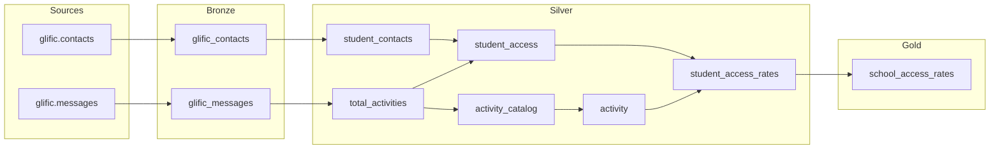

# tap — Activity Funnel (BigQuery)

dbt-core project for TAP activity funnel analytics on BigQuery. Warehouse runs materialize all models into the **Activity_Funnel** demo dataset.

## Prerequisites

- Python 3.11+
- BigQuery service account JSON key
- Git

## Setup

```bash
# Clone the repo
git clone https://github.com/vishal-patil-23/tap.git
cd tap

# Create virtual environment and install dependencies
python -m venv .dbtenv
source .dbtenv/bin/activate
pip install -r requirements.txt
```

Configure BigQuery credentials in `~/.dbt/profiles.yml`:

```yaml
tap:
  target: dev
  outputs:
    dev:
      type: bigquery
      method: service-account
      project: central-phalanx-297915
      dataset: MEL_2025_26
      keyfile: /path/to/your-service-account.json
      location: US
      threads: 4
```

## Local development (no BigQuery execution)

For day-to-day work on models, macros, and tests, use **local validation only**. These commands compile and check the project on your machine without running queries or writing tables in BigQuery:

```bash
dbt parse
dbt compile --select tag:activity_funnel
```

The following commands **execute against BigQuery** and should only be run when you explicitly intend to build or test in the warehouse (e.g. scheduled jobs, approved manual runs):

| Command | Effect |
|---------|--------|
| `dbt debug` | Tests live BigQuery connection |
| `dbt run` | Creates/updates tables and views |
| `dbt test` | Runs data quality checks in BigQuery |
| `dbt build` | Runs models and tests |
| `dbt seed` / `dbt snapshot` | Writes data to BigQuery |

Do not run warehouse commands during local development unless you have approved access and intend to materialize results.

## Activity Funnel pipeline (Bronze → Silver → Gold)

All models are tagged `activity_funnel`. Warehouse runs build tables into the **Activity_Funnel** dataset family using medallion layers.

### Bronze — raw extract

Source data च्या जवळ, minimal cleaning. Dataset: `Activity_Funnel_bronze`

| Model | Source | Type | Purpose |
|-------|--------|------|---------|
| `glific_contacts` | `glific.contacts` | Incremental | Contacts extract; dedupe by phone |
| `glific_messages` | `glific.messages` | Incremental | Messages extract by `contact_phone`, `flow_label`, `inserted_at` |

### Silver — cleaned & transformed

Business logic, joins, filters. Dataset: `Activity_Funnel_silver`

| Model | Depends on | Purpose |
|-------|------------|---------|
| `student_contacts` | `glific_contacts` | TLM25 students with school name (test phones excluded) |
| `total_activities` | `glific_messages` | Activity flow labels for Jul 2025–Jun 2026 |
| `activity_catalog` | `total_activities` | Sent activities only (no access/submission/complete) |
| `activity` | `activity_catalog` | Total activities sent per student |
| `student_access` | `student_contacts`, `total_activities` | Activities accessed per student |
| `student_access_rates` | `student_access`, `activity` | Per-student access rate |

### Gold — analytics & reporting

Final metrics for dashboards. Dataset: `Activity_Funnel_gold`

| Model | Depends on | Purpose |
|-------|------------|---------|
| `school_access_rates` | `student_access_rates` | School-level rollup; top 50 schools by access rate |

### Layer flow



Validate locally (no BigQuery):

```bash
dbt compile --select tag:activity_funnel
dbt compile --select tag:bronze
dbt compile --select tag:silver
dbt compile --select tag:gold
```

Run in BigQuery (approved warehouse runs only):

```bash
dbt build --select tag:activity_funnel
```

Warehouse output:

| Layer | BigQuery dataset |
|-------|------------------|
| Bronze | `Activity_Funnel_bronze` |
| Silver | `Activity_Funnel_silver` |
| Gold | `Activity_Funnel_gold` |

## Weekly sync (GitHub Actions)

The pipeline runs automatically every **Sunday at 12:05 AM IST** (Saturday 18:35 UTC) via `.github/workflows/weekly-sync.yml`.

It runs:

1. `dbt build --select tag:activity_funnel` (all Activity Funnel models + tests)

Output lands in BigQuery datasets **`Activity_Funnel_bronze`**, **`Activity_Funnel_silver`**, and **`Activity_Funnel_gold`**.

### One-time GitHub setup

Add these repository secrets in GitHub → **Settings → Secrets and variables → Actions**:

| Secret | Value |
|--------|-------|
| `GCP_SA_KEY` | Full JSON contents of the BigQuery service account key |
| `BQ_PROJECT` | `central-phalanx-297915` |
| `BQ_DATASET` | `Activity_Funnel` (optional; defaults to this value) |

Trigger a run manually from **Actions → Weekly TAP sync → Run workflow**.

## Git workflow

```bash
# Check status
git status

# Stage and commit changes
git add models/
git commit -m "Describe your change"

# Push to GitHub
git push origin main
```

Remote: https://github.com/vishal-patil-23/tap

## Project structure

```
tap/
├── dbt_project.yml
├── models/
│   ├── staging/glific-bigquery/   # Source definitions
│   ├── bronze/
│   ├── silver/
│   └── gold/
└── requirements.txt
```

Warehouse tables map to medallion datasets: `Activity_Funnel_bronze`, `Activity_Funnel_silver`, `Activity_Funnel_gold`.
