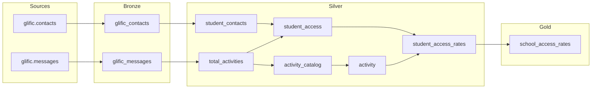

# tap — Activity Funnel (BigQuery)

dbt-core project for TAP activity funnel analytics on BigQuery. Warehouse runs materialize all models into the **Activity_Funnel** demo dataset.

## Prerequisites

- Python 3.11+
- BigQuery service account JSON key
- Git

### Layer flow



## Project structure

```
tap/
├── dbt_project.yml
├── models/
│   ├── staging/glific-bigquery/   # Source definitions
│   ├── bronze/
│   ├── silver/
│   └── gold/
└── requirements.txt
```
