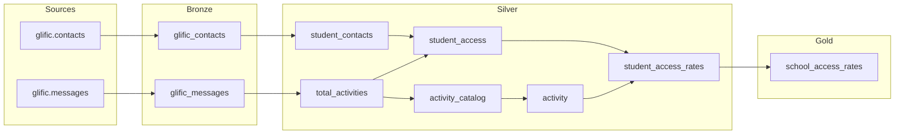

# tap — Activity Funnel (BigQuery)

dbt-core project for TAP activity funnel analytics on BigQuery. Warehouse runs materialize all models into the **Activity_Funnel** demo dataset.

## Prerequisites

- Python 3.11+
- BigQuery service account JSON key
- Git

## Setup

```bash
# Clone the repo
git clone https://github.com/vishal-patil-23/tap.git
cd tap

# Create virtual environment and install dependencies
python -m venv .dbtenv
source .dbtenv/bin/activate
pip install -r requirements.txt
```

Configure BigQuery credentials in `~/.dbt/profiles.yml`:

```yaml
tap:
  target: dev
  outputs:
    dev:
      type: bigquery
      method: service-account
      project: central-phalanx-297915
      dataset: MEL_2025_26
      keyfile: /path/to/your-service-account.json
      location: US
      threads: 4
```

## Local development (no BigQuery execution)

For day-to-day work on models, macros, and tests, use **local validation only**. These commands compile and check the project on your machine without running queries or writing tables in BigQuery:

```bash
dbt parse
dbt compile --select tag:activity_funnel
```

The following commands **execute against BigQuery** and should only be run when you explicitly intend to build or test in the warehouse (e.g. scheduled jobs, approved manual runs):

| Command | Effect |
|---------|--------|
| `dbt debug` | Tests live BigQuery connection |
| `dbt run` | Creates/updates tables and views |
| `dbt test` | Runs data quality checks in BigQuery |
| `dbt build` | Runs models and tests |
| `dbt seed` / `dbt snapshot` | Writes data to BigQuery |

Do not run warehouse commands during local development unless you have approved access and intend to materialize results.

## Activity Funnel pipeline (Bronze → Silver → Gold)

All models are tagged `activity_funnel`. Warehouse runs build tables into the **Activity_Funnel** dataset family using medallion layers.

### Incremental sync — raw data full scan नाही

Weekly run वेळी **फक्त नवीन/updated data** scan होतो. प्रत्येक layer मध्ये watermark (`updated_at`, `inserted_at`, `message_inserted_at`, `refreshed_at`) वापरून पुढच्या run साठी filter लावला जातो.

| Layer | Strategy | Raw scan? |
|-------|----------|-----------|
| **Bronze** | Source वर `inserted_at` / `updated_at > MAX(...)` filter | फक्त नवीन rows |
| **Silver** | Bronze मधून delta rows + फक्त बदललेले phones/schools recompute | Bronze delta only |
| **Gold** | Silver `student_access_rates` वरून सर्व schools rollup (raw scan नाही) | Silver only |

पहिला run (full load): सर्व tables create होतात. पुढचे weekly runs: MERGE/upsert — जुना data पुन्हा source मधून scan होत नाही.

### Bronze — raw extract

Source data च्या जवळ, minimal cleaning. Dataset: `Activity_Funnel_bronze`

| Model | Source | Type | Purpose |
|-------|--------|------|---------|
| `glific_contacts` | `glific.contacts` | Incremental | `updated_at` watermark; dedupe by phone |
| `glific_messages` | `glific.messages` | Incremental | `inserted_at` watermark; MERGE on phone + flow + time |

### Silver — cleaned & transformed

Business logic, joins, filters. Dataset: `Activity_Funnel_silver`

| Model | Depends on | Type | Purpose |
|-------|------------|------|---------|
| `student_contacts` | `glific_contacts` | Incremental | TLM25 students; फक्त `updated_at` बदललेले contacts |
| `total_activities` | `glific_messages` | Incremental | फक्त नवीन messages मधून activity flows |
| `activity_catalog` | `total_activities` | Incremental | नवीन/changed flows मधून sent activities |
| `activity` | `activity_catalog` | Incremental | फक्त बदललेल्या phones साठी count recompute |
| `student_access` | `student_contacts`, `total_activities` | Incremental | फक्त touched phones साठी access recompute |
| `student_access_rates` | `student_access`, `activity` | Incremental | फक्त touched phones साठी rate update |

### Gold — analytics & reporting

Final metrics for dashboards. Dataset: `Activity_Funnel_gold`

| Model | Depends on | Purpose |
|-------|------------|---------|
| `school_access_rates` | `student_access_rates` | School-level rollup; सर्व schools by access rate |

### Layer flow



Validate locally (no BigQuery):

```bash
dbt compile --select tag:activity_funnel
dbt compile --select tag:bronze
dbt compile --select tag:silver
dbt compile --select tag:gold
```

Run in BigQuery (approved warehouse runs only):

```bash
dbt build --select tag:activity_funnel
```

Warehouse output:

| Layer | BigQuery dataset | Example table |
|-------|------------------|---------------|
| Bronze | `Activity_Funnel_bronze` | `glific_contacts` |
| Silver | `Activity_Funnel_silver` | `student_access_rates` |
| Gold | `Activity_Funnel_gold` | `school_access_rates` |

### BigQuery dataset naming — कुठून येतं आणि कशासाठी?

**कुठून येतं (how it is created)**

1. `~/.dbt/profiles.yml` (किंवा GitHub Actions secret) मध्ये base dataset सेट असतो:
   ```yaml
   dataset: Activity_Funnel
   ```
2. `dbt_project.yml` मध्ये प्रत्येक folder ला schema दिला आहे:
   ```yaml
   bronze: +schema: bronze
   silver: +schema: silver
   gold:   +schema: gold
   ```
3. dbt हे दोन जोडून BigQuery **dataset** नाव तयार करतो:
   ```
   {profiles dataset}_{folder schema}
   ```
   म्हणजे `Activity_Funnel` + `bronze` → `Activity_Funnel_bronze`

**कशासाठी (why we use this)**

| Dataset | Use |
|---------|-----|
| `Activity_Funnel_bronze` | Raw Glific data ची copy/extract — source जवळ, फक्त basic clean |
| `Activity_Funnel_silver` | Filters, joins, business logic — analysis साठी ready data |
| `Activity_Funnel_gold` | Final dashboard/report tables — demo Activity Funnel output |

**उदाहरण:** Weekly sync नंतर BigQuery मध्ये तुम्हाला असे दिसेल:

```
central-phalanx-297915
├── Activity_Funnel_bronze
│   ├── glific_contacts
│   └── glific_messages
├── Activity_Funnel_silver
│   ├── student_contacts
│   ├── total_activities
│   └── ... (6 tables)
└── Activity_Funnel_gold
    └── school_access_rates
```

Dashboard किंवा Looker Studio साठी **`Activity_Funnel_gold.school_access_rates`** direct query करता येतो. Silver/Bronze debugging आणि data lineage साठी वापरले जातात.

## Weekly sync (GitHub Actions)

The pipeline runs automatically every **Sunday at 12:05 AM IST** (Saturday 18:35 UTC) via `.github/workflows/weekly-sync.yml`.

It runs:

1. `dbt build --select tag:activity_funnel` (all Activity Funnel models + tests)

Output lands in BigQuery datasets **`Activity_Funnel_bronze`**, **`Activity_Funnel_silver`**, and **`Activity_Funnel_gold`**.

### One-time GitHub setup

Add these repository secrets in GitHub → **Settings → Secrets and variables → Actions**:

| Secret | Value |
|--------|-------|
| `GCP_SA_KEY` | Full JSON contents of the BigQuery service account key |
| `BQ_PROJECT` | `central-phalanx-297915` |
| `BQ_DATASET` | `Activity_Funnel` (optional; defaults to this value) |

Trigger a run manually from **Actions → Weekly TAP sync → Run workflow**.

## Git workflow

```bash
# Check status
git status

# Stage and commit changes
git add models/
git commit -m "Describe your change"

# Push to GitHub
git push origin main
```

Remote: https://github.com/vishal-patil-23/tap

## Project structure

```
tap/
├── dbt_project.yml
├── models/
│   ├── staging/glific-bigquery/   # Source definitions
│   ├── bronze/
│   ├── silver/
│   └── gold/
└── requirements.txt
```

`Activity_Funnel_bronze`, `Activity_Funnel_silver`, `Activity_Funnel_gold` ही नावे `profiles.yml` मधील base dataset + `dbt_project.yml` मधील layer schema मधून तयार होतात (वर तपशील).
